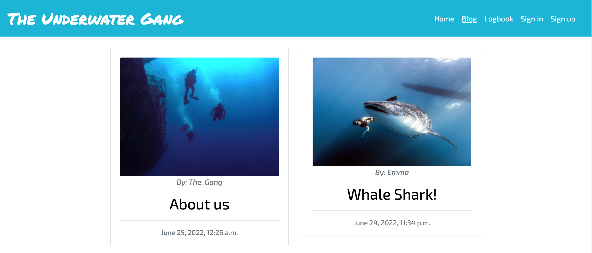
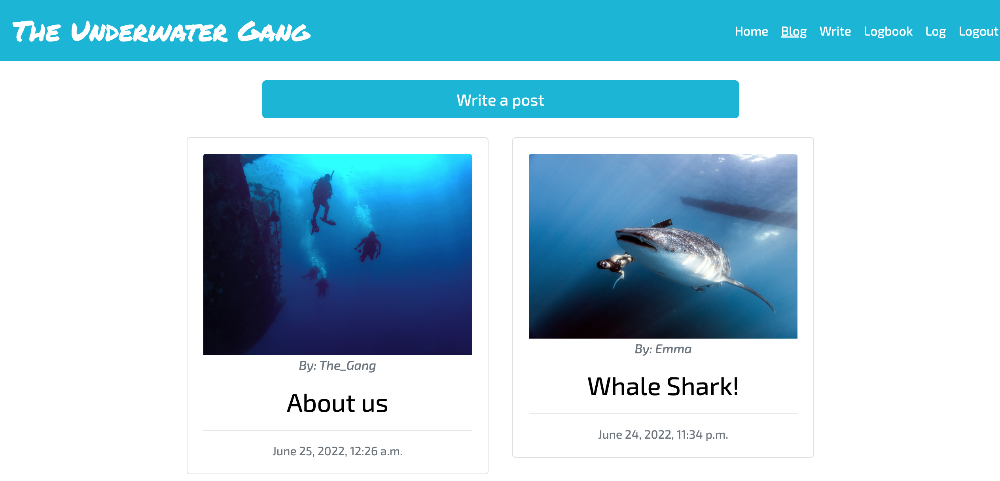
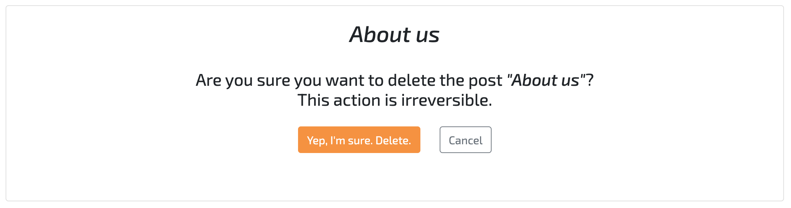
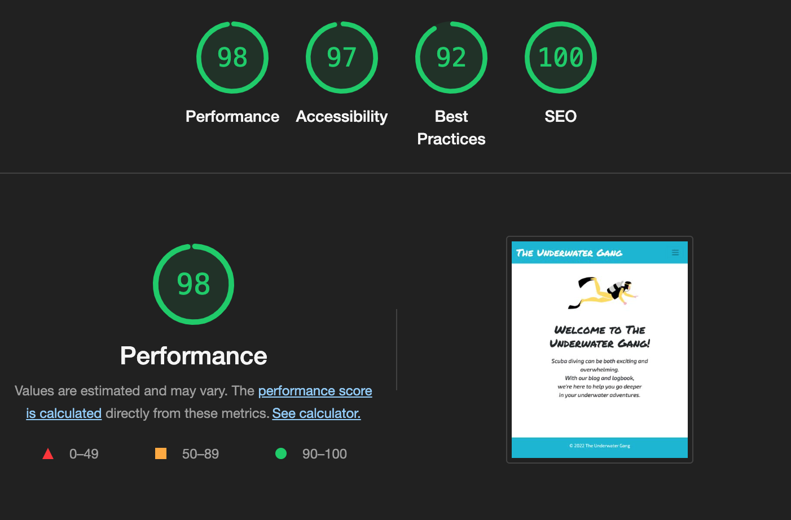

# **The Underwater Gang**

## **1. About** 

View the live project here: https://the-underwater-gang.herokuapp.com/.

The Underwater Gang is the website for a community of scuba divers, currently offering a blog for users to share their knowledge and experience on all things scuba and growing to include more features.

## **2. General User Goals** 

### **2.1 Site Owner's Goals**
The goal of the three owners is to see their website become the trusted companion for a thriving community of scuba divers.  
They want to offer a platform where ideas, tips, safety advice, personal experiences and stories can be shared by all divers, experienced or not. To do so, they offer a blog where registered users can write posts. For the community to receivetrue value and reliable information, all posts must be approved before being published. This will make sure that the site owners -- who are experienced divers themselves -- can filter out incorrect and potentially harmful information.

### **2.2. User Goals (UX)**
* New divers:
New divers are the first category of website users. Having recently discovered this amazing sport, they naturally want to expand their knowledge of it and come to the website as they search for resources online. 
* Pro divers:
The second category of users is made up of experienced divers looking for a platform of like-minded people;they desire to share what they have learnt over the years, as well as to hear from other long-time practitioners such as diving instructors or divemasters, i.e. underwater tour guides.
Both types of users can find a place not only to read from, but also to contribute to with their own posts.

## **3. User Stories, Manual Testing & Agile Development**

A detailed report regarding user stories, manual testing and agile development can be found here: [Agile](Agile.md)

## **4. Features**
### 4.1 *Existing features*

This section will provide an overview of the website. Where available, two different screenshots of each page/section will be provided, in order to show the difference in outlook depending on the signed-in/not sign-in status of the user.

* Homepage

The homepage concisely informs users of what the website is and what to expect from it.

* Site logo & Navigation Bar - General

The navbar for general, not-logged-in users shows the basic functions available to all users.

* Site logo & Navigation Bar - Signed-in user

The navbar for logged-in users changes to reflect the signed-in status of the user. The "Sign in" and "Sign up" icons are replaced by "Write a post" and "Logout".

* Blog - General

 The blog page available to all users, regardless of their status. It offers the possibility to browse and open posts.

* Blog - Signed-in user

 The blog page available to signed-in users. It offers the additional feature of writing a new post through the page-top button.

* Post content - General

 The post content available to all users, regardless of their status. It shows a picture (not shown here) and the main content.

* Post content - Signed-in user

 The extra features available to signed-in users, showing an additional section to post and read comments.

* Post - Write

The form to create a new post. It offers the possibility to upload an image, write a title and the main content.

* Post - Update

The form to update a post. It comes with the previous content already filled in.

* Post - Delete

A message that requires user confirmation for the deletion a post.

* Post - Choices

The two buttons at the bottom of the page show only for logged in users who are the creators of the post in question. They redirect the user to the update or delete pages.

* Sign in page

The sign in page for registered users.

* Sign up page

The sign up page for new users.

* Sign out page

The sign out page for new users.

### 4.2 *Features left to implement*
* *Log book*
   * An important addition to the website will be the creation of a logbook for divers to log new dives and browse old ones.
* *Diver's friendbook*
   * The goal of the website is to create a community, not only to provide a blog platform. For this reason, in the future divers will be able to add friends on their profile, thus creating meaningful human connections that hopefully extend into the real world (and sea).

## **5. Validation and Performance**
### 5.1 *Validator Testing*
* HTML
   * The final version of the code is free of errors when passed through the official W3C Markup Validator via URI. However, a difference was noted upon checking the .html files individually as opposed to validation via URI. Since this is a Django-based project, the source code had to be retrieved by right-clicking on each page in the front-end, then selecting the "View page source" option. In fact, the markup validation service is not able to recognize the Jinja templating language.

   

* CSS 
   * No errors were found when passing through the official W3C Jigsaw Validator.

   

* PEP8
   * The .py files in the blog app of the current project were passed individually through a PEP8 validator and no errors were returned.

### 5.2 *Responsiveness*
The site is fully responsive. 
Manual testing has been performed on the following three devices:  
- MacBook Pro (Retina, 13 inch, Late 2013);
- iPad Pro (12.9 inch, Third Generation);
- Xiaomi Redmi 5 (5.7 inch)

### 5.3 *Lighthouse Report*

* Mobile

As observable in the report screenshot, mobile performance is lower on mobile than on desktop. This will be improved in future versions of the project by applying modifications such as, for instance, those related to the size of the images.

* Desktop

### 5.4 *Accessibility*

A first Lighthouse report returned a score of 79/100 for accessibility, due to several missing aria-label attributes on buttons and links. After implementing the due corrections, the final score is 97/100.

### 5.4 *Internal and external links*

Every link on the website is fully functioning.

## **6.Deployment**

## **7. Technologies Used**
* Languages and Frameworks
   * **HTML5**
   * **CSS3**
   * **Python**
   * **Django**
   * **Bootstrap**

* Websites and Softwares
   * **Balsamiq**: used to create the website's wireframes (located in the 'documentation' folder)
   * **Font Awesome**: FA's icons were used to create the social media links found in the website's footer.
   * **Git**: Git was used for version control through the Gitpod terminal, to add, commit and push the project's updates to GitHub.
   * **GitHub**: GitHub, together with GitHub Pages, has been used to store the project's repository and deploy the website.
   * **Google Fonts**: Google Fonts has been used to import the two fonts in use on the website, namely the "Great Vibes" and "Montserrat" ones.
   * **ColorSpace and ColorHunt**: The color palette used in the project has been created on these websites.
   * **Asana**: Used for creating and storing user stories, and to keep track of the development process.
   * **Pexels**: For the post images.
   * **Icons8**: For the homepage drawing.

## **8. Credits**

### 8.1 *Credits*
All code was written by me personally. However, during the development process I relied considerably on the Code Institute *I Think Therefore I Blog* and Corey Schafer's Django tutorials. 
### 8.2 *Content*
The entirety of the content found on the website has been created by me personally. I drew from my personal experiences as a new scuba diver to create the text found in the two posts by the website creators, while creating other content for the remaining posts.
### 8.3 *Media*
All the images displayed on the website have been downloaded from Unsplash.com and Pexels.com. Here follows the list of the photographers whose work has made this project possible:
   * *Welcome to our blog!* photo by Pixabay 
   * *Exploring Uncharted Waters* photo by Pia
   * *Recoinnassance Dives* photo by Aviv Perets  
   * *Whale Shark!* photo by Emma Li
   * *About us...* photo by Ayman Zaki

The drawing on the homepage was downloaded from Icons 8.

## **9. Acknowledgments**

This project would have been impossible without the help of some incredible people, whom I wish to thank here.
- A special thank you goes to my mentor, Mr Richard Wells, for continuous guidance, suggestions and much needed encouragement. Thank you also for pushing me to do more, to go beyond my limits. It is a lesson I am still in the process of learning.
- Thank you to the talented people of the Tutoring team that helped me out: Ed, Alex, John and Sean. You have been very kind and tremendously helpful as I struggled with some parts of my project.
- The highest praise and thanks go to God, the greatest Coder of all eternity. To Him, who has shown his eternal love for all of us in Jesus Christ. To Him, whom I owe everything.

