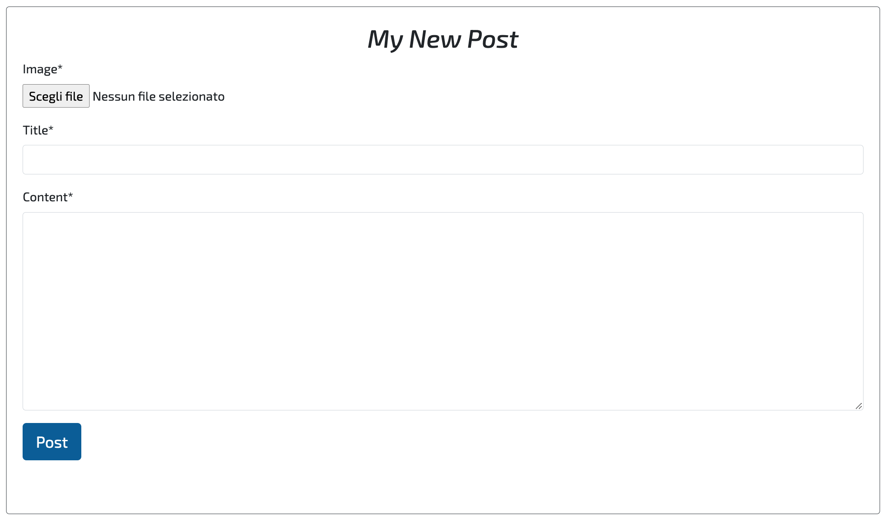
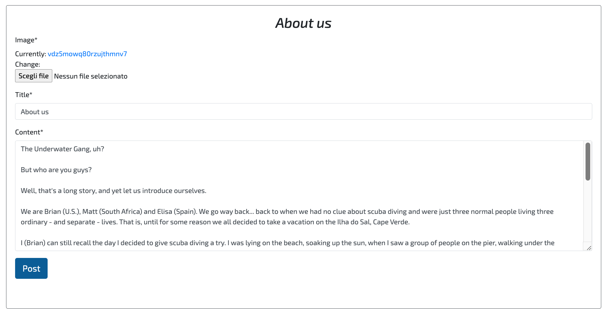
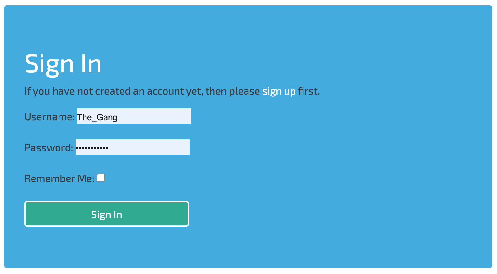

# **The Underwater Gang**

## **1. About** 

View the live project here: https://the-underwater-gang.herokuapp.com/.

The Underwater Gang is the website for a community of scuba divers, currently offering a blog for users to share their knowledge and experience on all things scuba and growing to include more features.

## **2. User Goals** 

### **2.1 Site Owner's Goals**
The goal of the three owners is to see their website become the trusted companion for a thriving community of scuba divers.  
They want to offer a platform where ideas, tips, safety advice, personal experiences and stories can be shared by all divers, experienced or not. To do so, they offer a blog where registered users can write posts. For the community to receivetrue value and reliable information, all posts must be approved before being published. This will make sure that the site owners -- who are experienced divers themselves -- can filter out incorrect and potentially harmful information.

### **2.2. User Goals (UX)**
* New divers:
New divers are the first category of website users. Having recently discovered this amazing sport, they naturally want to expand their knowledge of it and come to the website as they search for resources online. 
* Pro divers:
The second category of users is made up of experienced divers looking for a platform of like-minded people;they desire to share what they have learnt over the years, as well as to hear from other long-time practitioners such as diving instructors or divemasters, i.e. underwater tour guides.
Both types of users can find a place not only to read from, but also to contribute to with their own posts.

## **3. Features**
### 3.1 *Existing features*

This section will provide an overview of the website. Where available, two different screenshots of each page/section will be provided, in order to show the difference in outlook depending on the signed-in/not sign-in status of the user.

* Homepage

The homepage concisely informs users of what the website is and what to expect from it.

* Site logo & Navigation Bar - General

The navbar for general, not-logged-in users shows the basic functions available to all users.

* Site logo & Navigation Bar - Signed-in user

The navbar for logged-in users changes to reflect the signed-in status of the user. The "Sign in" and "Sign up" icons are replaced by "Write a post" and "Logout".

* Blog - General

 The blog page available to all users, regardless of their status. It offers the possibility to browse and open posts.

* Blog - Signed-in user

 The blog page available to signed-in users. It offers the additional feature of writing a new post through the page-top button.

* Post content - General

 The post content available to all users, regardless of their status. It shows a picture (not shown here) and the main content.

* Post content - Signed-in user

 The extra features available to signed-in users, showing an additional section to post and read comments.

* Post - Write

The form to create a new post. It offers the possibility to upload an image, write a title and the main content.

* Post - Update

The form to update a post. It comes with the previous content already filled in.

* Post - Delete

A message that requires user confirmation for the deletion a post.

* Post - Choices

The two buttons at the bottom of the page show only for logged in users who are the creators of the post in question. They redirect the user to the update or delete pages.

* Sign in page

The sign in page for registered users.

* Sign up page

The sign up page for new users.

* Sign out page

The sign out page for new users.

### 3.2 *Features left to implement*
* *Log book*
   * An important addition to the website will be the creation of a logbook for divers to log new dives and browse old ones.
* *Diver's friendbook*
   * The goal of the website is to create a community, not only to provide a blog platform. For this reason, in the future divers will be able to add friends on their profile, thus creating meaningful human connections that hopefully extend into the real world (and sea).

## **4. Validation and Performance**
### 4.1 *Validator Testing*
* HTML
   * The final version of the code is free of errors when passed through the official W3C Markup Validator via URI. However, a difference was noted upon checking the .html files individually as opposed to validation via URI. Since this is a Django-based project, the source code had to be retrieved by right-clicking on each page in the front-end, then selecting the "View page source" option. In fact, the markup validation service is not able to recognize the Jinja templating language.

   

* CSS 
   * No errors were found when passing through the official W3C Jigsaw Validator.

   

* PEP8
   * The .py files in the blog app of the current project were passed individually through a PEP8 validator and no errors were returned.

### 4.2 *Responsiveness*
The site is fully responsive. 
Manual testing has been performed on the following three devices:  
- MacBook Pro (Retina, 13 inch, Late 2013);
- iPad Pro (12.9 inch, Third Generation);
- Xiaomi Redmi 5 (5.7 inch)

### 4.3 *Accessibility*
Through the Chrome Developer Tools I have run two separate Lighthouse audits, one for mobile and one for desktop; both show a score of 98/100 for accessibility (please see the attached report in the 'documentation' directory or the image in the 'Other Lighthouse results' below). 

### 4.4 *Internal and external links*
Every link on the website is fully functioning.

### 4.6 *Other Lighthouse results*
* Mobile

* Desktop

The 'Best Practices' indicator consistently scored 100/100 on various audits and on both mobile and desktop.
The 'SEO' value shows a 5-point gap between mobile and desktop, scoring 95/100 for mobile and 100/100 for desktop.
Among the four different indicators, the 'Performance' value is the one worth noting for two reasons. As it can be observed in the image/reports, on this particular aspect there is a significant difference between mobile and desktop. In fact, the website's performance on a mobile device is significantly lower, having scored 75/100, whereas the same value increases to 95/100 on desktop.

Despite the lower performance showed in the mobile audit, the current value already represents a significant improvement from earlier versions of the website. In fact, the first audits showed a value slightly over 30/100, which has been improved considerably by further compressing all the images used on the website. Further improvement is possible and will be achieved in future versions of the website, thanks to an increased understanding of performance-related aspects on the developer's part.

### 4.7 *Testing User Stories*
* First-time user/visitor:
   * I want to find a herbalist shop in Turin, so I do a quick Google search and catch sight of this Herbalist's Counter website. I open the website and see the shop's welcome message. Right there on the homepage, I also get a clear idea of where the shop is located, what products they have on offer and what the owners' mission is.
   * I see a 'Contact us' section, where I guess I will be able to find the info I need, in particular the shop's opening hours and address. Before going there, however, I want to make sure this is a shop I actually *want* to visit, which leads me to browsing through the website. I start from the products page, mostly because as a first time user my goal is to see if this particular shop has what I need. It does, so I take a look at their 'Our shop' page, where I learn about the two owners' story and love for nature and herbal medicine. I also see an 'Events' page, which I find peculiar for a herbalist's shop. There, I learn that two events are organized on a monthly basis, something not offered by just any herbalist's shop. Now I have gathered enough information about the shop to decide that it's a place worth going to, at the very least because, judging by the style they adopt in their writing, the two owners sound like a fun couple.
* Returning user/visitor:
   * I have already visited The Herbalist's Counter a few times, and I ended up buying not only that herbal tea I needed for my cold, but also a couple bars of Aleppo soap and two varieties of tea. The Counter is a nice place to visit, and now that I need to purchase another pound of herbal tea I open the website to check if the opening hours are still the same. The opening hours are unchanged, but since in the past I took part in the Herbal Friday event and had a good time there, I decide to navigate to the 'Events' section to check if that activity is still on offer. It is, and I also find an interesting surprise: a new event, a tea ceremony that will soon start to be organized every month. I am fascinated by it, so I take a mental note to ask the owners about this when I visit the shop.

## 5. **Deployment**
The site has been deployed to GitHub Pages. The steps to deploy are as follows:
   * In the 'herbalist-counter' GitHub repository, navigate to the 'Settings' page.
   * Within the 'Settings' page, open the GitHub Pages dedicated section.
   * In the 'Source' section, you can find a 'Branch' drop-down menu. Select 'main' and save the changes.
   * When the site has been successfully deployed, a message of 'Your site is published at https://...' will be displayed. (Before that, a message of 'Your site is ready to be published at https://...' will pop up during the upload.)
   * The website is now accessible through this link: https://gabriele-andolina.github.io/herbalist-counter/.

## 6. **Technologies Used**
* Languages
   * **HTML5**
   * **CSS3**
* Websites and Softwares
   * **Balsamiq**: used to create the website's wireframes (located in the 'documentation' folder)
   * **Font Awesome**: FA's icons were used to create the social media links found in the website's footer.
   * **Git**: Git was used for version control through the Gitpod terminal, to add, commit and push the project's updates to GitHub.
   * **GitHub**: GitHub, together with GitHub Pages, has been used to store the project's repository and deploy the website.
   * **Google Fonts**: Google Fonts has been used to import the two fonts in use on the website, namely the "Great Vibes" and "Montserrat" ones.
   * **Compresss.com**: This website has been instrumental in reducing the size of the images employed in the project, with the positive result of an increased performance in the final version.
   * **ColorSpace**: The color palette used in the project has been created on this website.

## 7. **Credits**
### 7.1 *Code*
All code (with the exception of the "Where to find us" section's iframe, credited below) has been personally written, however I referred to the documentation throughout the entire development process.
### 7.2 *Inspiration*
Some online resources have been very helpful in the code-writing process. Among these is the 'Love Running Walkthrough Project', which has proven beneficial to lay down a sequential path for the development of a website. I have also availed myself of additional online resources such as Stack Overflow and CSS-tricks.com, albeit never copying code.
### 7.3 *IFrame*
The IFrame within the 'Where to find us' section has been created and imported from the Google Maps Platform (within the Google Cloud Platform and accessible here: https://cloud.google.com/)
### 7.4 *Content*
The entirety of the content found on the website has been created by me personally. The specific herbal mixtures written of in the 'Herbs' section ('Our products' page) come from a tiny booklet with some herbal tea suggestions given to me by the herbalist I usually visit for my herbal purchases.
### 7.5 *Media*
All the images displayed on the website have been downloaded from Unsplash.com. Here follows the list of the photographers whose work has made this project possible:
   * *Hero image* by Swapnll Dwivedi 
   * *Our story* photo by Peter Conlan
   * *The Counter* photo by Matt Briney 
   * *Our Philosophy* photo by NeONBRAND
   * *Herbs* photo by Katherine Hanlon
   * *Tea* photo by Desi Dermz. 
   * *Soaps and perfumes* photo by Paul Gaudriault 
   * *Herbal Friday* photo by Annie Spratt 
   * *Tea ceremony* photo by 五玄土
   * *Where to find us* photo by Mike Petrucci
   * *Get in touch* photo by Stanley Dai
   * *Thank you* photo by Towfiqu barbhuiya
### 7.6 *Acknowledgments*
A special thank you to my mentor, Mr. Can Sucullu, who has greatly helped me and wisely instructed me throughout the entire project.

